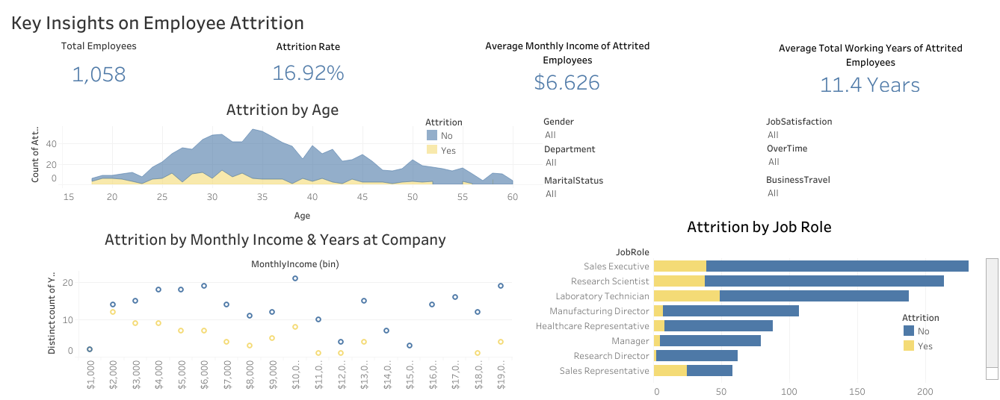

# Menyelesaikan Permasalahan Human Resources

## Business Understanding

Perusahaan saat ini tengah menghadapi tantangan serius dalam menjaga stabilitas tenaga kerjanya. Tingginya angka karyawan yang mengundurkan diri tidak hanya berdampak pada produktivitas operasional, namun juga berpotensi menghambat pertumbuhan perusahaan secara keseluruhan. Permasalahan ini perlu segera ditangani untuk mencegah dampak negatif yang lebih besar pada produktivitas dan biaya operasional perusahaan. Untuk itu, memahami penyebab utama dari keputusan karyawan untuk meninggalkan perusahaan menjadi langkah strategis dalam menyusun kebijakan retensi yang lebih efektif di masa depan.

### Business Problem

- **Kurangnya Pemahaman atas Faktor Penyebab**
    
    Belum adanya kejelasan tentang variabel atau kondisi kerja seperti lingkungan, kepuasan, hingga beban kerja yang paling berpengaruh terhadap keputusan karyawan untuk keluar.
    
- **Keterbatasan Alat Pemantauan**
    
    Departemen HR belum memiliki media visualisasi yang komprehensif untuk memantau tren attrition secara dinamis, sehingga sulit mengambil keputusan berbasis data secara cepat.
    
- **Minimnya Strategi Pencegahan yang Terukur**
    
    Tidak ada rekomendasi berbasis data yang dapat dijadikan landasan untuk membuat kebijakan retensi yang efektif dan terukur.

### Project Scope

- **Eksplorasi Data Karyawan**

    Melakukan analisis deskriptif terhadap data demografi, jabatan, gaji karyawan dll untuk mengenali pola-pola yang berkaitan dengan keputusan untuk berhenti bekerja.

- **Identifikasi Pola dan Faktor Risiko**
    
    Menganalisis hubungan antar variabel untuk menemukan faktor-faktor kunci yang berkorelasi tinggi dengan keputusan karyawan untuk keluar dari perusahaan.

- **Pembuatan Dashboard Interaktif**
    
    Mendesain dan membangun dashboard bisnis interaktif untuk menyajikan insight terkait faktor-faktor utama penyebab attrition, yang dapat digunakan oleh tim HR dalam pengambilan keputusan.
    
- **Pembuatan Model Prediktif**
    
    Membangun model machine learning sederhana yang dapat memperkirakan kemungkinan seorang karyawan melakukan attrition berdasarkan variabel-variabel yang tersedia.

### Preparation

**Data source:** [Employee data](https://github.com/dicodingacademy/dicoding_dataset/tree/main/employee 'Dicoding GitHub - Employee data')

**Setup environment:**

1. Clone this Repository
   ```bash
   git clone https://github.com/sitirobiiatul/Employee-Attrition-Analysis.git
   ```

2. Create Python Virtual Environment
   ```bash
   virtualenv venv
   ```

2. Activate the Environment
   ```bash
   venv\Scripts\activate
   ```

4. Install All the Requirements Inside "requirements.txt"
   ```bash
   pip install -r requirements.txt
   ```

**To run the Streamlit prediction:**
```bash
streamlit run streamlit_app.py
```

**Streamlit Link**

Link cloud streamlit dapat diaksaes melalui: https://employee-attrition-analysis-sitirobiiatul.streamlit.app/

## Business Dashboard

Dashboard interaktif menggunakan Tableau ini dibuat untuk membantu tim HR memahami pola dan faktor-faktor utama yang menyebabkan attrition (pengunduran diri) karyawan.



Dashboard ini memberikan gambaran menyeluruh atas data karyawan, mencakup:

- Total employees dan attrition rate secara keseluruhan.

- Rata-rata gaji bulanan dan total masa kerja karyawan yang sudah keluar (attrited).

- Distribusi attrition berdasarkan usia, jabatan, pendapatan bulanan, dan lama bekerja.

Gunakan filter interaktif di sisi kanan dashboard yang terdiri dari **Gender**, **Department**, **Marital Status**, **Job Satisfaction**, **Over Time**, **Business Travel** untuk mengeksplorasi pola attrition lebih dalam.

🔗 Akses Dashboard:
👉  [Klik di sini untuk melihat dashboard di Tableau Public](https://public.tableau.com/views/EmployeeAttritionDashboard_17465404934230/Dashboard2?:language=en-US&:sid=&:redirect=auth&:display_count=n&:origin=viz_share_link 'Tableau Public- Employees Attrition Dashboard')

## Conclusion

Berikut ringkasan temuan utama dari analisis data terkait Employee Attrition yang telah dilakukan:

- **Attrition Berdasarkan Usia dan Masa Kerja**

Karyawan berusia 19–30 tahun memiliki tingkat attrition tertinggi, dengan penurunan signifikan setelah usia 35 tahun. Karyawan dengan masa kerja 0–3 tahun juga mencatatkan angka attrition tertinggi.

- **Attrition Berdasarkan Pendapatan**

Karyawan dengan pendapatan bulanan di bawah 3.000 USD lebih banyak mengalami attrition dibandingkan dengan mereka yang berpendapatan di atas 5.000 USD.

- **Attrition Berdasarkan OverTime**

Sebagian besar karyawan yang mengalami attrition berasal dari kelompok yang bekerja lembur. Karyawan yang tidak lembur menunjukkan angka attrition yang jauh lebih rendah.

- **Attrition Berdasarkan Job Role dan Perjalanan Dinas**

Posisi sebagai Sales Executive dan Laboratory Technician memiliki tingkat attrition tertinggi. Sementara itu, posisi Research Director dan Manager menunjukkan tingkat attrition paling rendah.
Karyawan dengan frekuensi perjalanan dinas yang sering (Travel_Frequently) juga menunjukkan tingkat attrition yang lebih tinggi dibandingkan kategori lainnya.

### Recommended Action Items

Berikut adalah rekomendasi kebijakan strategis yang dapat diambil berdasarkan temuan pada analisis data attrition:

- **Retensi untuk Karyawan Muda & Baru**

Fokuskan program onboarding, mentorship, dan career development pada karyawan berusia 19–30 tahun dan yang memiliki masa kerja kurang dari 3 tahun. Segmentasi program pelatihan awal sangat penting untuk meningkatkan loyalitas dan keterikatan.

- **Review dan Penyesuaian Gaji**

Tinjau kembali struktur gaji untuk memastikan bahwa karyawan dengan penghasilan di bawah 3.000 USD tetap mendapatkan kompensasi yang kompetitif, terutama pada level awal atau posisi rentan terhadap attrition.

- **Manajemen Beban Kerja Lembur**

Implementasikan kebijakan manajemen lembur yang lebih sehat dan fleksibel. Pertimbangkan untuk memantau dan membatasi frekuensi lembur guna mencegah burnout yang dapat menyebabkan attrition.

- **Pengembangan Karier Berdasarkan Role**

Posisi seperti Sales Executive dan Laboratory Technician memerlukan perhatian khusus dalam hal jalur pengembangan karier dan motivasi kerja. Sediakan pelatihan lanjutan, peluang promosi, dan pengakuan prestasi untuk mengurangi turnover.

- **Evaluasi Kebijakan Perjalanan Dinas**

Frekuensi perjalanan dinas yang tinggi terbukti berkontribusi terhadap attrition. Pertimbangkan pemberian kompensasi tambahan, opsi perjalanan yang fleksibel, atau penggantian peran dengan tugas hybrid untuk mengurangi beban.

- **Prediksi tingkat kemungkinan karyawan akan mengundurkan diri**

Prediksi tersebut dapat dilakukan melalui dashboard interaktif berbasis Streamlit yang sudah dicantunkan di atas.
Pengguna cukup memasukkan karakteristik seorang karyawan, dan sistem akan memberikan estimasi apakah karyawan tersebut berisiko mengalami attrition.
